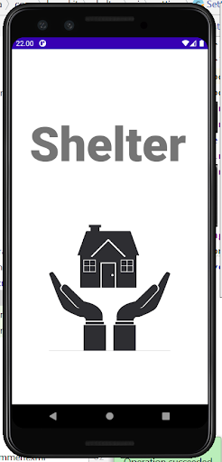
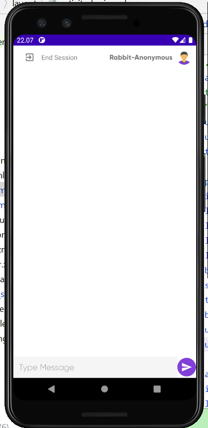

# Bangkit Team B21-CAP0189

# Member
1. Soni Marko Nathanniel Tannady	  (c2442286) Email : c2442286@bangkit.academy
2. Tony Wijaya 				              (a1221569) Email : a1221569@bangkit.academy
3. Widya Arditanti 			            (m2442280) Email : m2442280@bangkit.academy
4. Nurlaily Rahmatika 			        (m2582419) Email : m2582419@bangkit.academy
5. Giry Retno Indra Pangestu 		    (c0050534) Email : c0050534@bangkit.academy

## Theme : Healthcare
## Title of Project : Shelter

### Summary of Project
Many people don't want to share their problems and choose to shut themselves because of some reasons (trust issues, shame, etc). Our project  purpose is to make a way to share a user's problem without worrying about the user's privacy and match with the user's personality. According to WHO’s data, every 40 seconds, one person dies by committing suicide[1](https://news.detik.com/berita/d-4391681/tingkat-bunuh-diri-indonesia-dibanding-negara-negara-lain),  where suicide occurs because of a mental health disorder. That’s why we want to help people strengthen each other so they don’t give up on their lives.

## Screenshots of the Apps

  
  

## Instructions to use the App
1. Download Apk by Clicking this [APK](https://40-362776836-gh.circle-artifacts.com/0/artifact-file/app-debug.apk)
2. Download the APK to you android phone
3. Go to Register side and fill all sections from name, email, password and confirm password.
4. Make sure your passsword with length of 6
5. Then fill the login section with data from registration
6. Before login check you email verification first 
7. Then fill the questionnaire with selecting the rating bar
8. Wait until you enter the home feature
9. You ready to use the apps

## Project Scope & Deliverables :

#### All:
- Determining the problem statement and the solution
- Arrange the required features
- Do the proposal
- Make the project documentations
- Make a Project Brief
- Make a 10 Minute Video Recording for Presentation
- Make a presentation
- Make a Business / Go-to-market Proposal
- Overall Application Testing

#### Android
- Make a design mockup application
- Implementation Feature in android application
- Connect Data To Firebase Console
- Using Firebase storage, realtime database and firestore to link a google Cloud 
- Connect the model using TFLite

#### Cloud
- Manage GCP Firestore, APIs, and Credentials
- Manage and Configure Data Storage using Firebase
- Deploy Machine Learning models using Firebase ML
- Creating a simple dashboard for monitoring the consumers quota in GCP

#### Machine Learning
- Pre-process the dataset by filling in missing values, defining outliers and dropping the unnecessary columns.
- Differentiate the data using clustering based on 5 types of personality.
- Change the label data structure to one hot encoding.
- Build personality test model using neural networks
- Export the keras model into Tensorflow Lite model.

## Project Resources

### Budget
- Google Cloud Platform Subscription : **$200**

### Roles:

##### Soni Marko Nathanniel Tannady & Giry Retno Indra Pangestu:
- Cloud Developer Team
##### Tony Wijaya:
- Android Developer Team
##### Widya Arditanti & Nurlaily Rahmatika:
- Machine Learning Developer Team

### Dataset:
- [Big Five Personality Test](https://www.kaggle.com/tunguz/big-five-personality-test)

### Paper / Journals / articles:
- [Big Five Personality](https://openpsychometrics.org/printable/big-five-personality-test.pdf)
- [Predicting Big Five](https://www.researchgate.net/publication/262164553_Predicting_Big_Five_Personality_Traits_of_Microblog_Users)

### Design Apps :
- [Design](https://www.figma.com/file/y37fzinTCpDlRr8phg5EE9/Shelter-Apps?node-id=1%3A4)
